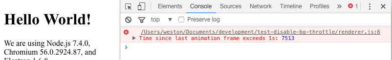

# Running the test

Assuming you have NPM set up...

`npm start`

The window will pop up, along with the dev tools.  Hide the window behind
another window for a while, and then check the error log.

If the animation frame took more than 1 second, you'll see an error message.

## Electron Versions
Behavior appears incorrect between version 1.5.0 and 8.0.0.

This test borrows heavily [nathansobo's original RAF test](https://github.com/nathansobo/disable-renderer-backgrounding-test-case) for the same issue.  
This is mostly just a fresher version using Electron Quickstart and a more recent Electron version. 

